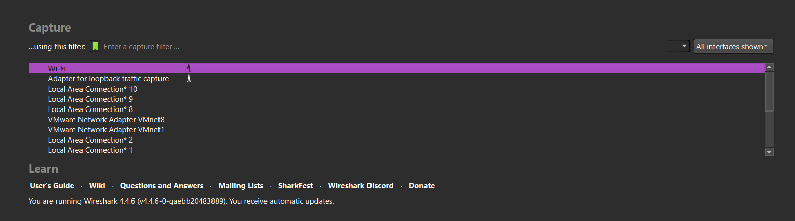
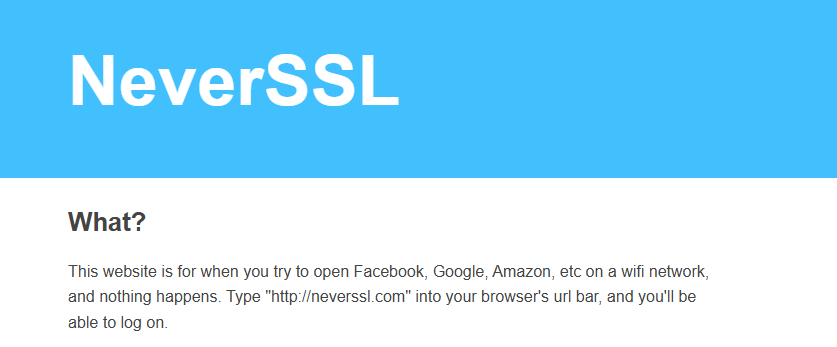
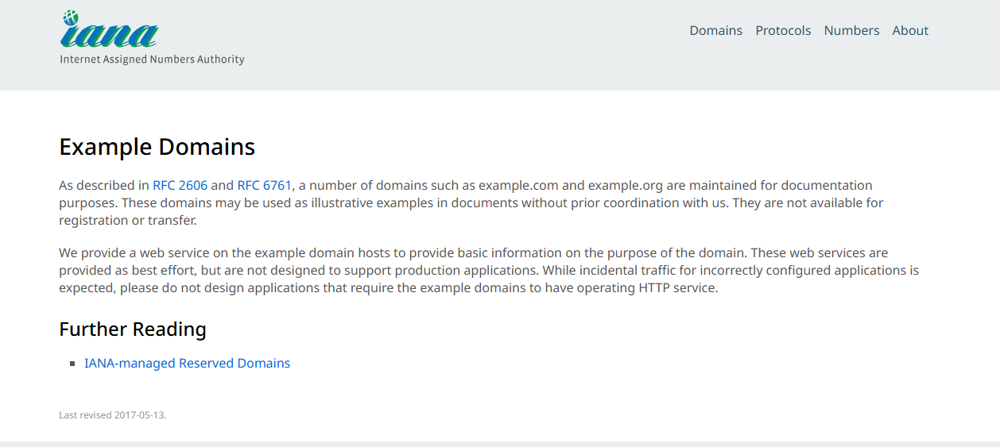
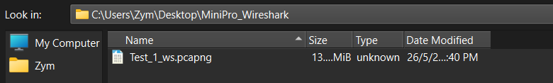
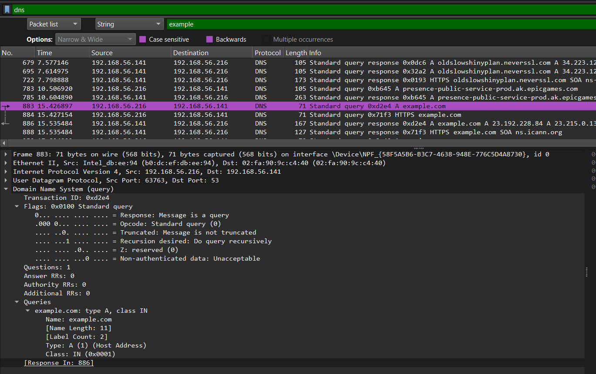
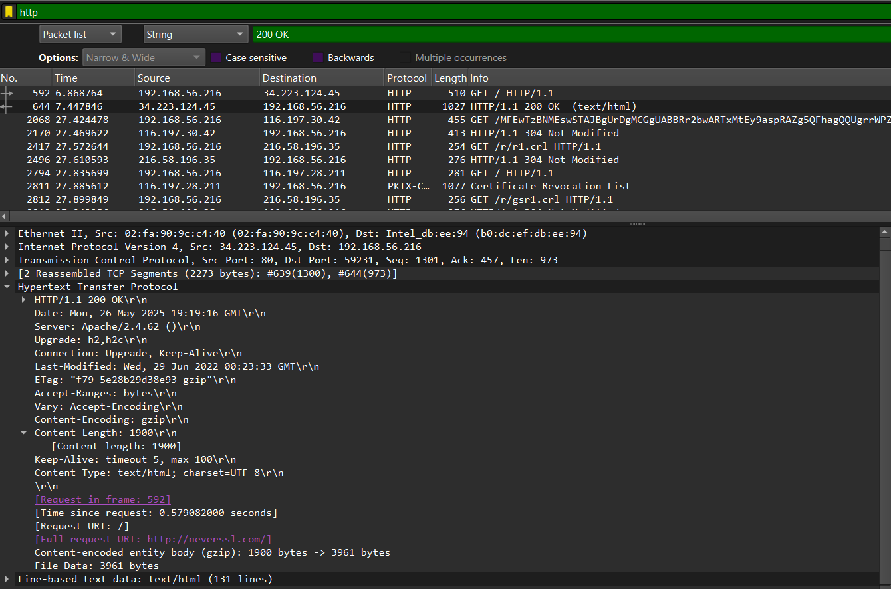
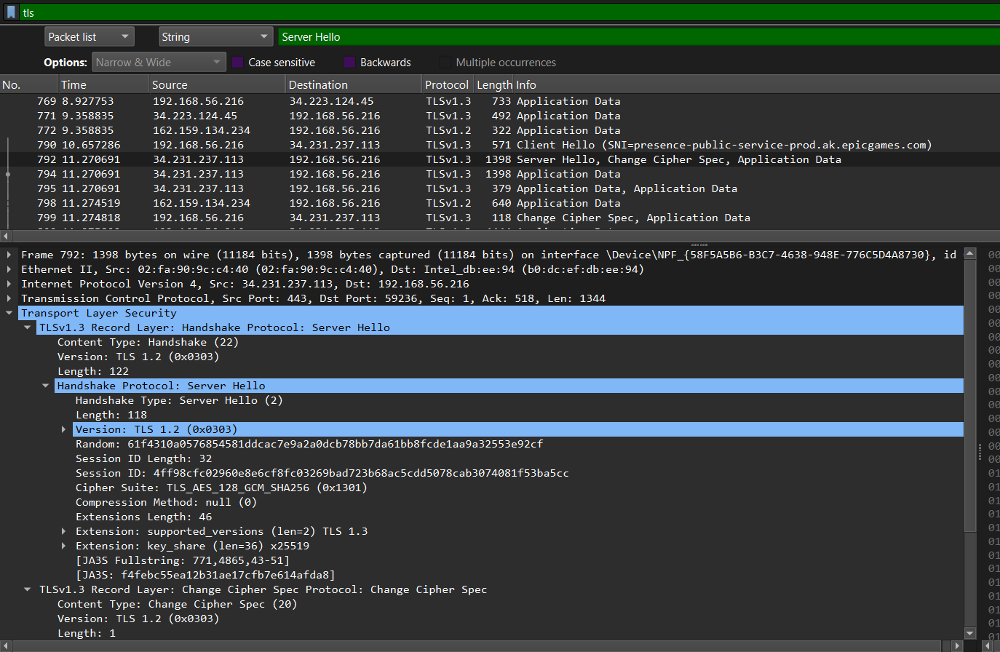
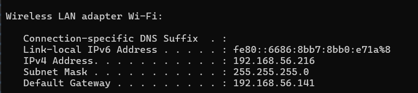
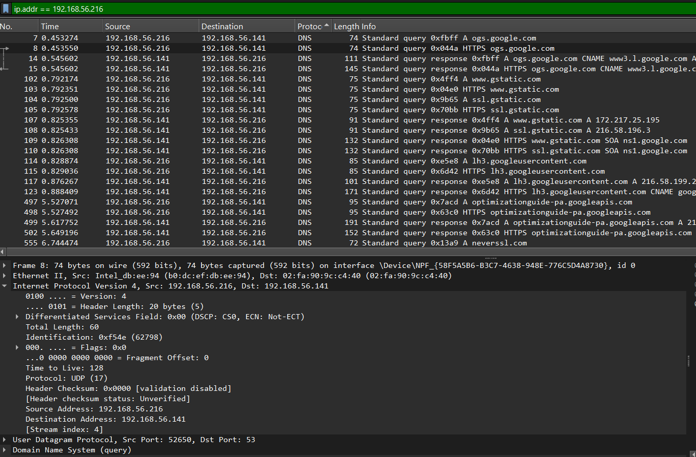

# Web Traffic Analysis using Wireshark

This walkthrough documents the steps taken to monitor and analyze web traffic using Wireshark on a host machine. The objective is to capture and inspect DNS, HTTP, and HTTPS communications from a browser session.

---

## 🔧 Environment Setup

- **[Wireshark](https://www.wireshark.org/)** installed on host system (Windows)

- **Npcap** installed with the following options enabled:

  - ✅ Restrict Npcap driver access to administrators only

  - ✅ Support raw 802.11 traffic for wireless adapters

  - ✅ Install Npcap in WinPcap API-compatible mode

---

## 🟢 Step 1: Start Wireshark and Select Interface

1. Launch **Wireshark**.

2. Select the correct interface:

   - If using Wi-Fi: select `Wi-Fi` or equivalent.
  
   - If using Ethernet: select `Ethernet`.

3. Confirm that packets are appearing in real time before continuing.



---

## 🟡 Step 2: Trigger Web Traffic from Browser

While Wireshark is running, open a web browser and visit the following websites:

1. [`http://neverssl.com`](http://neverssl.com) – to trigger **HTTP** traffic.

   

2. [`https://example.com`](https://example.com) – to trigger **HTTPS** (simple TLS handshake).

   

3. [`https://google.com`](https://google.com) – to trigger **DNS + HTTPS** and more encrypted traffic.

   

Allow each site to fully load before continuing.

---

## 🔴 Step 3: Stop and Save the Packet Capture

1. Go back to Wireshark.

2. Click the red **Stop** button to end the capture.

   

3. Save the file as `web_traffic.pcapng` using:

    ```bash
    File → Save As → Choose location
    ```



---

## 🔍 Step 4: Analyze Captured Traffic

### 🔎 DNS Analysis

- **Filter**: `dns`

**What to look for:**

- `Standard query A example.com` — your system requesting an IP.

- `Standard query response A example.com A 93.184.216.34` — DNS server reply with the resolved IP.

**Steps:**

1. Enter `dns` in the Wireshark filter bar.

2. Check the **Info** column for lines with DNS queries and replies.

3. Click a packet → Expand `Domain Name System` section.

4. Confirm:

   - **Query Name**: like `example.com`
   - **Answer Address**: the returned IP address



---

### 🌐 HTTP Analysis

- **Filter**: `http`

**What to look for:**

- `GET / HTTP/1.1` — request to load a webpage.

- `HTTP/1.1 200 OK` — server's response with data.

**Steps:**

1. Apply `http` filter.

2. Look for packets showing `GET` and `200 OK`.

3. Click the packet → Expand `Hypertext Transfer Protocol` section.

4. Look at headers like:

   - **Host**
   - **User-Agent**
   - **Content-Type**



---

### 🔐 HTTPS / TLS Analysis

- **Filter**: `tls`

**What to look for:**

- `Client Hello` — browser initiates secure session.

- `Server Hello` — server replies with supported settings.

- `Certificate` — server sends TLS certificate.

**Steps:**

1. Use `tls` filter.

2. Scroll to find lines with:

   - `Client Hello`

   - `Server Hello`

   - `Certificate`

3. Click packet → Expand `Transport Layer Security`.

**What to check:**

- TLS version (e.g. TLS 1.2, TLS 1.3)

- Cipher Suites

- Certificate issuer and subject

- `Client Hello`

   

- `Server Hello`

   

---

### 📡 IP and Port Analysis

- **Filter**: None, or use `ip.addr == <your_ip>` (replace with your actual IP)

Checking Ip in `Windows Poershell`



**What to observe:**

- Source IP and Port → your machine

- Destination IP and Port:

  - 80 = HTTP

  - 443 = HTTPS

  - 53 = DNS

**Steps:**

1. Click any packet (DNS, HTTP, or HTTPS).

2. Expand:

   - `Internet Protocol Version 4`

   - `Transmission Control Protocol` or `User Datagram Protocol`

3. Note:

   - `Source IP` & `Source Port`

   - `Destination IP` & `Destination Port`

**Extra Exploration:**

- Right-click packet → **Follow TCP Stream** or **Follow UDP Stream**

  - View entire session conversation (requests & responses).

💡 **Reminder:** Replace `<your_ip_here>` with your actual local IP address (can find via `ipconfig` or `ip a` on Linux/Kali).



---

## ✅ Summary

This analysis demonstrates how Wireshark can be used to inspect different types of traffic:

- DNS name resolution

- HTTP cleartext web traffic

- TLS encrypted HTTPS communication

- Source and destination IP/port tracing

*Wireshark is a powerful tool to understand what happens on a network and is highly useful for network monitoring and security analysis.*

---
